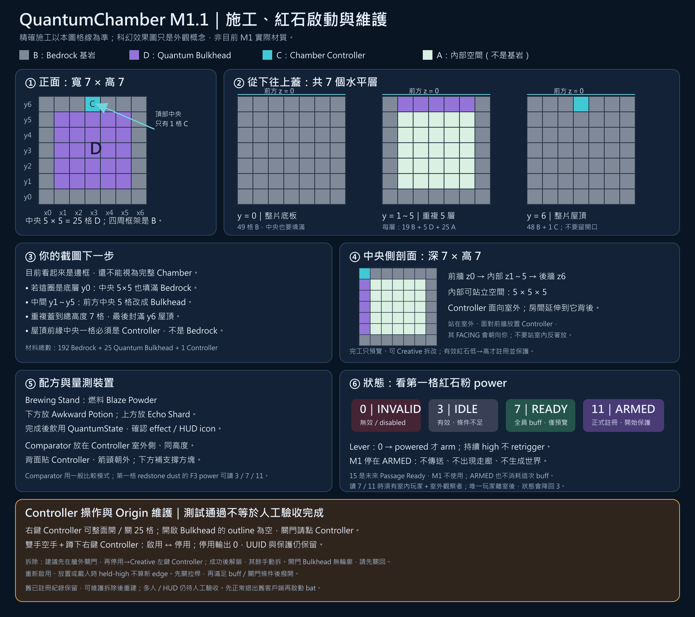

# M1／M1.1／M1.2 玩家施工與驗證指引

本指引對應 `feature/m1-chamber` 的 M1.2：有效原艙（Origin）由外部供電註冊／保護，再讓單人入內關門、補齊藥水，自動進入 ARMED。這是操作指引與待驗清單，不是已通過人工驗收的證據。M1.2 仍無走廊、傳送或效果消耗；M2 尚未實作。

## 啟動本分支的開發客戶端

目前 M1 尚未合併 `main`，本機請從 `.worktrees/m1-chamber` 工作區啟動，不要在只有 M0 基底的 main 目錄呼叫 Wrapper。另一台電腦若直接 clone／checkout `feature/m1-chamber`，則在該 clone 的根目錄執行，不必另建同名 worktree。

最方便的方式是在檔案總管進入該工作區，雙擊 `start-client.bat`。聊天中的檔案連結供閱讀，不會自動執行。PowerShell 也可使用：

```powershell
Set-Location 'C:\Users\Ben\Documents\minecraft QuantumChamber\.worktrees\m1-chamber'
.\start-client.bat
```

腳本會保留明確 JAVA_HOME；未設定時嘗試已安裝 Adoptium Java 21，或由 Wrapper 判斷 PATH Java。失敗會停留並保留原始錯誤碼。腳本為 UTF-8／CRLF，請保留 Git 的單檔 eol 規則，不要另存成 LF 中文 batch。

若要明確指定本機 JDK，PowerShell 原始啟動方式：

```powershell
Set-Location 'C:\Users\Ben\Documents\minecraft QuantumChamber\.worktrees\m1-chamber'
$env:JAVA_HOME='C:\Program Files\Eclipse Adoptium\jdk-21.0.12.101-hotspot'
$env:PATH="$env:JAVA_HOME\bin;$env:PATH"
.\gradlew.bat --no-daemon runClient
```

這是 Fabric 開發客戶端，會自動編譯／載入此工作區的模組，使用 `run/client-base`，不是將 JAR 自動安裝到微軟官方 Launcher 的 mods 目錄。世界位於 `run/client-base/saves`；既有世界可繼續使用，方塊 ID 與儲存 schema 沒有改動。

若舊遊戲仍開著，先正常儲存並退出，再啟動新版本。不要同時用兩個客戶端開同一世界。

### 選用手持火把照明：獨立客戶端與存檔

無參數的 `start-client.bat` 仍啟動原本 `run/client-base`，不安裝照明模組。若要測試手持火把照明，請使用：

```powershell
.\start-client.bat light
# 或直接呼叫相同的 Gradle 工作
.\gradlew.bat --no-daemon runClientLight
```

`light` 使用全新的獨立 `run/client-light`，世界位於 `run/client-light/saves`；不會自動移動或複製玩家世界。首次只解析固定的官方 LambDynamicLights `3.1.4+1.21.1`，驗證 SHA512 後才複製到此 profile 的 `mods`。解析失敗、來源遺失或 hash 不符都會停止，不會假裝照明可用後繼續開遊戲。未知或多餘參數以非零狀態退出並顯示 `start-client.bat [light]` 用法，不啟動 Minecraft。

官方 JAR 的 client-only metadata 支援本案 Minecraft 1.21、Fabric Loader 0.17.2、Fabric API 0.102.0+1.21 與 Java 21；必要的 SpruceUI／PrideLib 已由該 JAR 內嵌，Mod Menu 只是建議，不另加必要依賴。照明不加入 `client-base`、server、GameTest 或 QuantumChamber 發行 JAR。客戶端初始化日誌會記錄 `lambdynlights` 是否存在；存在日誌與 metadata 相容不等於已人工驗證照明或 shader。

請優先在 light profile 建立新測試世界。若確實需要使用既有世界，先正常退出所有遊戲，再手動將來源世界資料夾完整備份到遊戲目錄外；確認備份後，人工複製到另一 profile 的 `saves`，不要移動／覆蓋原檔，也不要同時開啟同一世界。這是可選的人工作法，啟動腳本不會操作 `saves`。

主手／副手火把、移動後照明、熄滅效果、GPU 與 shader 相容性均列為人工待驗。M1.2 的 POWERED 原艙輝光由可信原艙身分判定，不等於手持火把照明，也不代表 M2 走廊已完成。



[可放大的格線原圖](../images/m1-chamber-build-guide.svg)｜[科幻外觀概念圖](../images/m1-chamber-concept.png)

## 1. 準備材料

請使用創造模式測試世界，並以物品名稱辨認方塊。新版 Quantum Bulkhead 是紫色面板，Chamber Controller 是青色框與正面核心，兩者仍保留基岩底層／外框；繁體中文介面請搜尋「量子艙門」與「腔室控制器」。若仍看到兩者完全像基岩，請先確認已退出舊遊戲並從 M1 工作區啟動新版本。

| 艙體方塊 | 數量 | 用途 |
| --- | ---: | --- |
| Bedrock（基岩） | 192 | 底板、側牆、後牆、外框與屋頂 |
| Quantum Bulkhead（量子艙門） | 25 | 正面中央 5×5 的整面艙門 |
| Chamber Controller（腔室控制器） | 1 | 正面最上排中央的控制器 |

額外準備 Brewing Stand、Blaze Powder、Water Bottle、Nether Wart、Echo Shard、Comparator、Lever、Redstone Dust，以及外接裝置的支撐方塊。紅石裝置不是艙體的三種材料。

紫色／青色表面只引用 Minecraft 既有材質，不代表要用紫珀方塊、混凝土或海燈籠來建造；實際放置仍只能是上表三種艙體方塊。新造型會套用到原有世界與物品圖示，不必拆掉受保護的艙體。

## 2. 從截圖的外框繼續蓋

1. 用方塊逐格確認外側寬與深都是 **7 格**；截圖的透視不能取代實際數格。
2. 指定一面當正面。以下 `y` 是相對底板高度，不是世界的絕對 Y 座標。
3. `y=0`：底板整片 7×7 都是基岩。若截圖這圈就是底板，中央草地區也要換成 5×5 基岩。
4. `y=1`：正面是 `B D D D D D B`；左牆、右牆與後牆是基岩；中央 5×5 留作室內空間。
5. 重複上一層配置，蓋到 `y=5`。累計得到 **25 個 Bulkhead**，不是普通基岩門。
6. `y=6`：屋頂封成完整 7×7；正面最上排是 `B B B C B B B`，其餘都是基岩。
7. 站在室外、面對前牆放置 Controller，使其 `facing` 朝向室外。可用 F3 瞄準 Controller 核對朝向及記下座標。
8. 最終外側 **7×7×7**，牆厚 1 格，室內 **5×5×5**；192 基岩＋25 Bulkhead＋1 Controller。

**M1.2：供電保護與 ARMED 資格分離。** 完工但未供電時尚未註冊，可用創造模式拆改。有效艙體供電後，Registry 健康且不重疊即可註冊 UUID，保護整個 7×7×7；此時空艙、缺效果或門開著仍是 IDLE／3，不需要先有室內玩家或 buff。

保持供電，玩家完整入內、非 spectator、關門且全員有 QuantumState，便自動 ARMED／11，無須再到室外製造新的 rising edge。玩家離開、buff 到期或門開會取消目前 M1.2 的 ARMED 資格，但仍供電便仍受保護。斷電先進行安全協調；只有確認為 OFF 的原艙才解除保護，UUID 與 Registry 碰撞占位仍保留。RETURNING／UNKNOWN／協調失敗都不能先解鎖。室內裝置請在供電前規劃。

## 3. 釀造與飲用

1. Brewing Stand 左側燃料槽放 Blaze Powder。
2. 下方瓶槽放 Water Bottle，上方材料槽放 Nether Wart，先做出 Awkward Potion。
3. 下方留下 Awkward Potion，上方材料換成 Echo Shard，釀造 QuantumState Potion（量子態藥水）。
4. 飲用後檢查效果列表、HUD 圖示與倒數時間；這個效果為 3 分鐘。測試時間較長時要補喝。

實際釀造、飲用及 HUD 必須人工觀察，不能以單元測試或直接加入效果當作這一項通過。

## 4. 比較器配置與觀察分工

比較器放在 Controller **室外側、同一高度**，比較器的背面（兩支火把的一側）對著 Controller，輸出端朝外。比較器與輸出端第一格紅石粉下方都要有支撐方塊，且應維持一般比較模式；不要在第一格紅石粉旁再放其他電源。請在室外支撐方塊頂面放置比較器；若直接點 Controller 放外接元件，**手拿要放的物品並蹲下**，避免被當成門控右鍵。雙手空手蹲下右鍵另有維護功能。

F3 的比較器 `facing` 是朝輸入側，不是輸出側。例如 Controller 朝 `north`，比較器在其北側，比較器 `facing` 應為 `south`，紅石粉接在比較器北側。這對應目前實體 comparator GameTest 的配置。

```text
室內／前牆       室外
Controller → Comparator → Redstone Dust
               下方支撐       下方支撐
```

外接輸入拉桿與比較器輸出線分開。可在創造模式飛到屋頂，手拿 Lever、蹲下點 Controller 頂面，把拉桿放在 Controller 正上方，位於艙體範圍外，供電給 Controller。這個拉桿的實際手動操作仍列為待驗；M1.1 已加入原生 lever 邊緣 GameTest，但不能把原生 API 調用當作滑鼠瞄準／操作的人工驗收。

M1.2 可由唯一玩家先在室外撥桿供電，再自己入內測試；實體比較器的室內資格讀值仍可請外部觀察者協助。

- 室內玩家不能是 spectator，且整個玩家碰撞箱必須在 interior 內；不要站在門檻或卡牆。
- 室外觀察者以 F3 瞄準輸出端**第一格紅石粉**，讀取 `power`。
- 唯一玩家走出去看比較器後，室內變成零人，下次刷新會回到 IDLE。不能因此判斷 ARMED 壞掉，也不能把仍供電的原艙視為已解鎖。
- 單人若允許指令，可留在室內輸入 `/data get block <X> <Y> <Z> ChamberState`，將座標替換成 Controller 的實際座標。這只能檢查狀態，**不能取代實體比較器驗收**。

### 單人普通玩法：先供電、再入艙

1. 尚未供電時完成艙體與室內裝置，釀好 QuantumState Potion。
2. 在室外把 Controller 的外接拉桿撥成供電；空艙預期 IDLE／3，但 UUID 已註冊、艙體已保護。
3. 普通右鍵開門，走進 interior，再瞄準入口上方 Controller 關門。
4. 完整站在室內並飲用藥水；持續供電就會自動 ARMED／11，不必離開室內重撥拉桿。
5. M1.2 停在原艙 ARMED，不消耗藥水效果、不建立走廊、不傳送；M2 尚未實作。
6. 要解除保護或拆除，先到艙外切斷供電並等待安全協調確認 OFF；不要以管理停用取代斷電。

若創造模式世界允許指令，也可於 **Controller 正上方一格（艙體範圍外）**放紅石方塊作為替代輸入。先確認該格沒有其他建築／裝置；這不取代實體拉桿與比較器的人工驗收。

例如 Controller 實際座標是 `100 70 100`，其正上方就是 `100 71 100`。先依你自己的 F3 座標換算，**不要直接套用範例座標**：

```mcfunction
/setblock 100 71 100 minecraft:air
/data get block 100 70 100 ChamberState
/setblock 100 71 100 minecraft:redstone_block
/data get block 100 70 100 ChamberState
/data get block 100 70 100 ChamberUuid
```

維持人在 interior：第一個 air 指令讓輸入保持低，全員有 buff 且關門可預覽 READY／7；第二個 setblock 供電後應自動 ARMED 且 UUID 存在。供電前查 `ChamberUuid` 沒有欄位屬於正常草稿。測試結束移走紅石方塊並等待 OFF；只修改艙體外這一格，不用刪世界。

## 5. 待執行的人工驗證

| 步驟 | 操作 | 預期觀察 |
| --- | --- | --- |
| A | 新建有效艙體、室內空無一人；輸入保持低電位 | IDLE，輸出 3；尚未註冊／保護，Creative 可拆改 |
| B | 唯一玩家在室外將有效空艙供電 | IDLE／3；UUID 已註冊且整艙保護，不要求先喝藥或關門 |
| C | 保持供電，玩家完整入內、非 spectator、全員有 QuantumState、門已關 | 自動 ARMED／11，不需新的 rising edge |
| D | 持續供電，喝牛奶移除效果，再補喝 QuantumState | 先降 IDLE／3，再自動 ARMED／11；供電保護持續 |
| E | 切斷供電並等待安全協調確認 OFF | 原艙解除保護，但 UUID／碰撞占位保留；不確定狀態不得提早解鎖 |
| F | 另在不重疊空地建一座尚未登錄的測試艙，刻意少放一格基岩 | INVALID，輸出 0；不要拆已受保護的第一座 |
| G | 保持供電，兩位室內玩家，其中一位缺效果 | 不得 ARMED，輸出 3；兩人都補上效果並關門後自動 ARMED／11 |
| H | 右鍵艙門或 Controller 開門，進入後右鍵 Controller 關門 | 整面 25 格開／關同步；原生 ServerWorld 互動已經過 GameTest，正常滑鼠操作仍須人工觀察 |
| I | 觀察上述全程 | 沒有傳送、走廊、新 Dimension、Universe 配置或 buff 消耗；M1.2 停在原艙 ARMED |
| J | 保持供電的已註冊 Origin，雙手空手、蹲下右鍵 Controller | 管理停用，輸出 0；UUID 保留、方塊仍受保護，普通右鍵仍能開關門 |
| K | 保持供電，以同一手勢重新啟用並滿足室內資格 | 自動 ARMED／11；管理停用期間仍供電便仍受保護 |
| L | 已確認 OFF、完整原艙身分，Creative 左鍵 Controller | 成功移除才清除 UUID 記錄／所有相交 chunk 索引；不要求先管理停用 |
| M | 同位置重建完整艙體，再供電 | 成功註冊新的 UUID，不重用被拆除艙體的 UUID |
| N | `start-client.bat light`，新測試世界主手／副手持火把並移動 | 動態照明人工待驗；client-base／server 不應新增照明模組 |

兩位室內玩家的實體輸出案例需另外安排外部觀察者，或使用供電前已設置並驗證的室內讀值線路。帳號或觀察條件不足時，該項保留「待驗」，不要算通過。

每項請記錄實際結果與截圖；輸出 15 不屬於 M1 的預期狀態。

## 6. 停用、重新啟用與拆除

1. 只有已註冊的原始艙體（Origin）可維護；不是投影、錯世界或身分對不上都會拒絕。
2. 建議先到艙外，用創造模式飛行靠近 Controller 可見的正面／頂面；艙門關閉時，不要假設站在室內還能瞄準被其他方塊遮住的 Controller。清空主手與副手（盾牌、火把等也要拿掉），按住 Shift／蹲下，右鍵青色 Controller。
3. 管理停用（Enabled=false）後比較器為 0；UUID 保留，門仍可用普通右鍵開關。外部仍供電時保護仍持續；管理停用不等於斷電或拆除。
4. 同手勢可重新啟用；保持供電並滿足全員 buff／關門條件，即自動回到 ARMED／11。
5. 要拆除：先在艙外關門，讓 25 格 Bulkhead 回到可瞄準狀態；再切斷外部供電並等待安全協調確認 OFF。確認完整原艙身分後，用**創造模式左鍵 Controller**；不要求先管理停用，Enabled=true 也可在確定 OFF 後拆。只有實際移除成功才清除 Registry UUID 記錄／所有相交 chunk 索引。
6. 最後手動拆其餘基岩與紫色 Bulkhead。此版本不改基岩強度；解除模組保護不表示生存模式可以挖基岩。

維護不要求整座 shell 完整，但必須能核對原 Controller 與持久化記錄；操作失敗不應提早解除保護。尚未註冊的草稿直接 Creative 拆即可，不需維護，也不能藉維護偷偷註冊。

若已在「門開著」時拆掉 Controller，開啟的 Bulkhead 仍是 outline 為空的方塊，滑鼠不能直接挖。可在未受保護的原位置暫放一個同方向 Controller，普通右鍵將有效門面關回去，再以 Creative 拆除草稿 Controller 與 Bulkhead；不要供電，避免重新註冊。沒有完整 shell 時先修好幾何，或由管理者以限定方塊座標的指令清除剩餘 Bulkhead，不用刪世界。

**舊版世界：** 舊 UUID／管理旗標保留，不因升版刪除記錄或世界；保護按目前外部供電與可信原艙身分重新核對。若想重測草稿供電註冊，先切斷外部供電、確認 OFF 後 Creative 拆 Controller 再重建，或另選空地新建。身分無法可靠核對時不得提早解鎖；不要刪整個世界。

## Controller 門控與客戶端重啟

2026-09-16 已依使用者核准方案新增 Controller 的右鍵門控。關閉的 Bulkhead 仍可以右鍵開門；開啟後 outline 為空，滑鼠不能再次瞄準門，請改瞄準前牆最上排中央的 Controller。

1. 先正常儲存並退出舊客戶端，再啟動新版本；正在執行的舊 JVM 不會熱載入此修正。
2. 室外可右鍵艙門或 Controller 開門，全部 25 格同步開啟。
3. 進入 interior 後靠近入口，但整個身體仍留在室內、不要站在門面上。
4. 從開口瞄準門頂中央 Controller 的底面或可見表面，再右鍵關門。若無法瞄準，先確認方向、距離與視線，勿把已開啟的空門格當目標。
5. 未供電時，有 buff 且門關閉可預覽 READY／7；保持供電並滿足資格便自動 ARMED／11。目前 M1.2 開門回 IDLE／3，再關門且 buff 有效會自動回 11；沒有 M2 真實 ACTIVE session 或走廊服務。

這個入口保留原本的 25-block transaction、authorization 與同步刷新，不新增 GUI、renderer 或自訂 packet。原生互動自動回歸不代表上述滑鼠／視線／HUD／多人步驟已人工通過；請逐項記錄。

## 圖片說明

- 格線施工圖直接依實際幾何與狀態契約繪製；PNG 是 SVG 的轉出版本。
- 科幻概念圖使用內建圖片生成工具，附件只作為 Minecraft 場景參考。提示內容摘要：7×7×7 基岩艙體、5×5×5 剖面、5×5 艙門、頂部中央控制器、外接比較器與拉桿，使用原創青色／紫色科幻語彙，禁止傳送門、走廊與 AE2 資產複製。
- 概念圖的格數、材質、亮度與控制器細節可能藝術化；**施工以格線圖及本文件為準**。M1.2 POWERED 時的可信原艙輝光不等於概念圖效果，也不替代選用手持照明。
